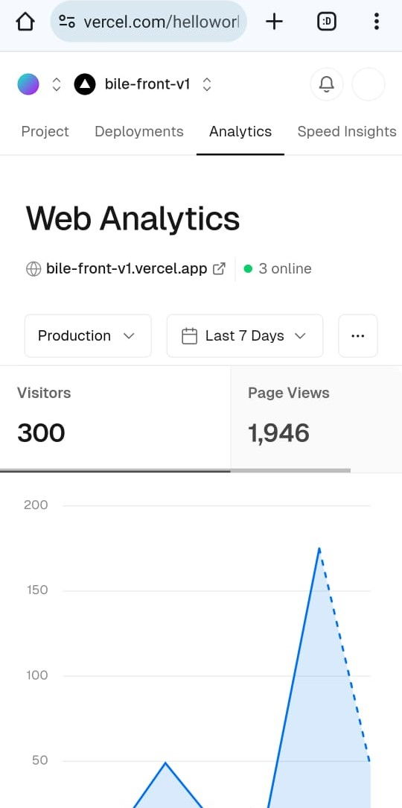

# DanceGen

DanceGen is an innovative application that generates dance movements based on user-provided music names. It leverages the YouTube Data API to retrieve audio files and uses the EDGE (Editable Dance Generation) machine learning model to create corresponding dance movements.

## Demo

Check out our demo video to see DanceGen in action:

[Demo Video](./demo_video.gif)

## User generated Dances
I have stopped the GPU VM I rented, and now only the dance animations generated in August during the launch are available.
[Generated dances](https://bile-front-v1.vercel.app/en/all-dances)

## Features

- Generate dance movements from any music name
- 3D visualization of generated dance movements using Autodesk FBX
- Efficient task queuing with Redis
- Secure deployment on Microsoft Azure
- File storage on Amazon S3
- User data management with MongoDB

## Tech Stack

- Backend: FastAPI, Docker
- Frontend: Next.js, TypeScript, Tailwind CSS
- Database: MongoDB
- Cache and Queue: Redis
- Cloud Services: Microsoft Azure, Amazon S3
- APIs: YouTube Data API
- 3D Visualization: Autodesk FBX

## Architecture


## Back end
[Back end](https://github.com/youngccame1/bile-ai)

## Installation

1. Clone the repository:
   ```
   git clone https://github.com/youngccame1/bile-ai-3d.git
   cd dancegen
   ```
3. Set up the frontend:
   ```
   cd frontend
   npm install
   npm run dev
   ```

## Usage

1. Navigate to the application in your web browser.
2. Enter the name of a song or music piece.
3. Click "Generate Dance" to create a dance sequence.
4. View the 3D visualization of the generated dance movements.

## User Analytics



As of August 2024, DanceGen has gained 300 users within the first 3 days of launch.

## Contributing

We welcome contributions to DanceGen! Please read our [Contributing Guidelines](CONTRIBUTING.md) for details on our code of conduct and the process for submitting pull requests.

## License

This project is licensed under the MIT License - see the [LICENSE](LICENSE) file for details.

## Acknowledgements

- EDGE (Editable Dance Generation) model creators
- YouTube Data API
- Autodesk FBX SDK

## Contact

For any queries, please reach out to [your_email@example.com](mailto:your_email@example.com).
